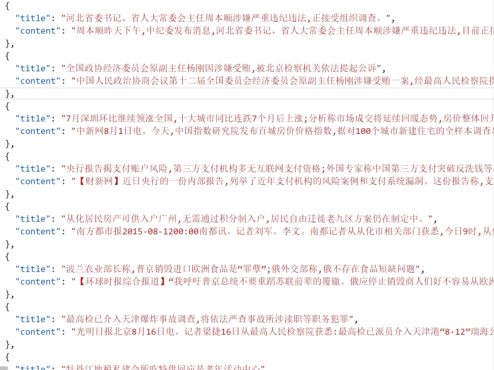
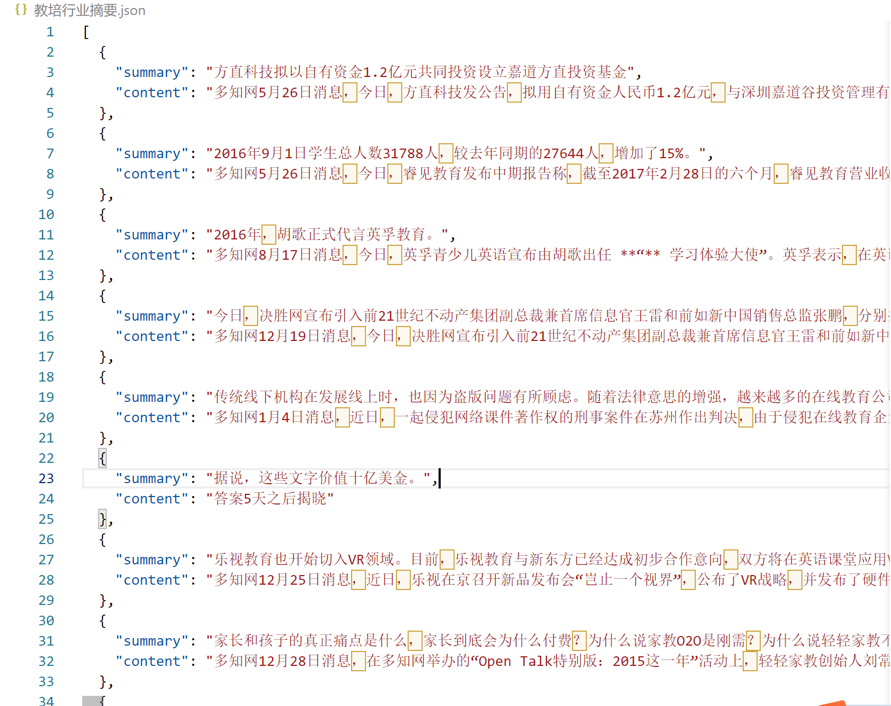

## 新闻摘要&教培行业消息摘要数据集

### 介绍
本数据集包含新闻摘要数据集和教培行业消息摘要数据集。
由于 Github 文件大小限制，部分文件做了压缩，其中有 `.001` 后缀的为分卷压缩，请下载全部同名文件并解压第一个文件即可。 

#### 新闻摘要
主要来自 nlpcc2017 和 LCSTS。分别对应文件 `nlpcc2017_clean.json` 和 `CNews_sum.json`。二者数据格式为
    
```json
{
    "data": [
        {
            "title": "摘要",
            "content": "正文"
        },
        {
            "title": "摘要",
            "content": "正文"
        }
    ]
}
```

此两文件来自：https://blog.csdn.net/daotianweng/article/details/121036353

文件 `CNews_sum_dz.json` 为尝试寻找出的和党政相关的新闻摘要数据集。数据格式为
    
```json
[
    {
        "title": "摘要",
        "content": "正文"
    },
    {
        "title": "摘要",
        "content": "正文"
    }
]

```

如下：


对应脚本为 `提取党政新闻.py`

#### 教培行业消息摘要
文件为 `教培行业摘要.json`，约 24000+ 条。部分摘取如下：



### 最后
如有帮助，欢迎 Star，谢谢！